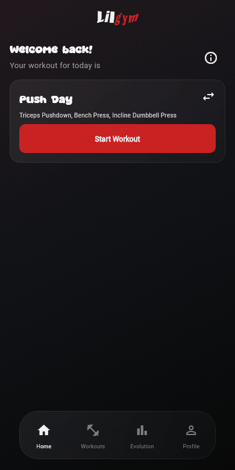
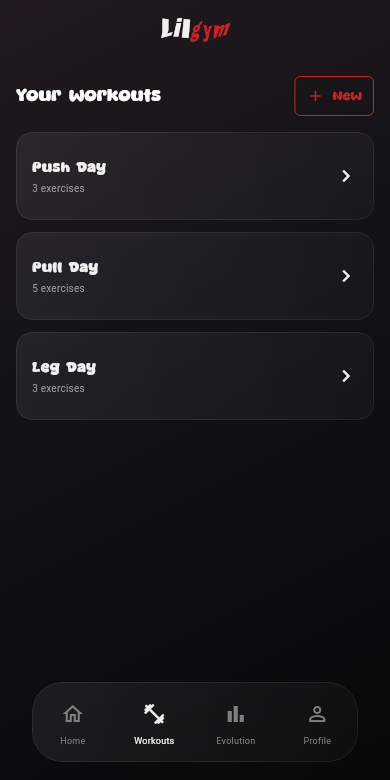
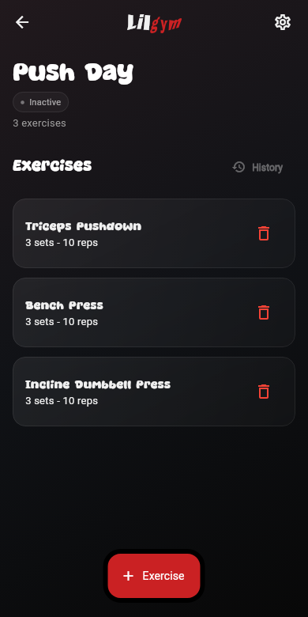
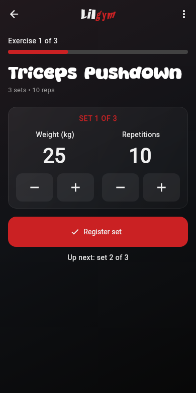

# lilgym

> just a lil more progress, one set at a time

A minimal workout tracker built with Flutter. Pick your workout, log your sets, and pick up where you left off — with a dark, glass-style interface that keeps the next rep in focus.

Sibling project of [lilnote](https://github.com/ericfr1tzenvalle/lilnote) and [lil-code](https://github.com/ericfr1tzenvalle/lil-code). Same philosophy: small apps, focused interfaces.

<p align="center">
  
</p>

## A little less friction

- Create and rename workouts, with exercise counts at a glance.
- Log weight and reps, with previous-session values ready for your next set.
- Leave a session and resume it while the app stays open.
- Finish your workout, see your summary, and move on to the next one.

<p align="center">
  
  
  
</p>

## Run it

With Flutter installed and a device or desktop target available:

```bash
flutter pub get
flutter run
```

Still growing: data currently lives in memory and resets when the app restarts. Exercise selection, persistent storage, and progress charts are not available yet. The preview uses the app's sample workouts.
